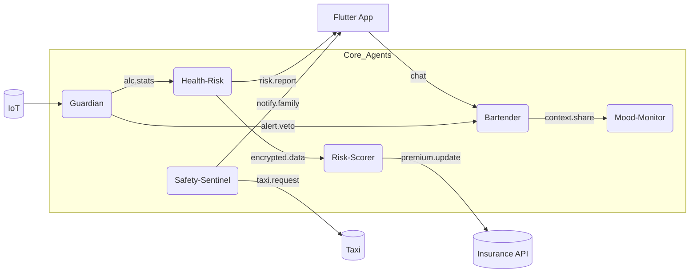
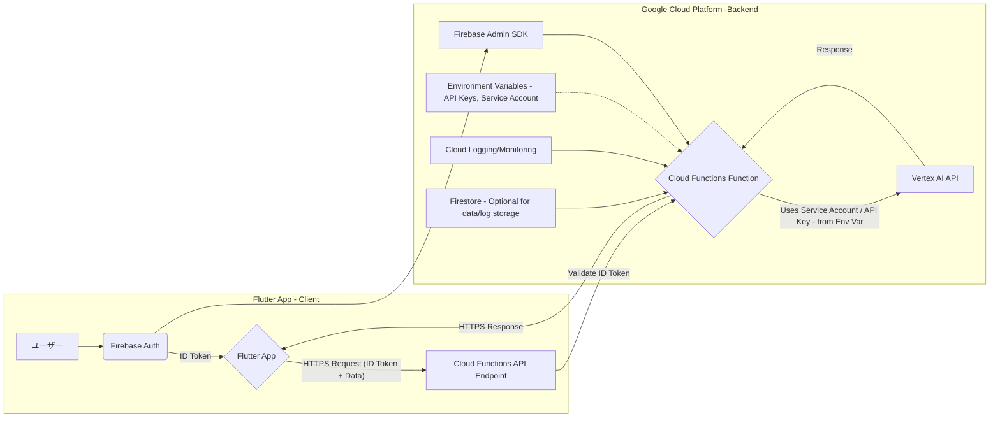

# AI Bartender Suite (alco-guardian)

> **リアルタイム介入 × マルチエージェント協調**で「医者より先に止める」価値を提供するアルコール管理アプリ

## 🎯 概要

「**AI Bartender Suite**」は **A2A (Agent-to-Agent) プロトコル** と **Google Agent Development Kit (ADK)** を使い、複数エージェントがリアルタイムで協調しながら "飲み過ぎ・孤独・安全リスク" をまとめて解決するモバイルアプリです。

*WHO が示す "アルコールに安全量はない"* 課題に対し、行動変容を"飲んでいる最中"に促すことが最大の価値です。

## 🏗️ システム構成

### コアコンセプト
- **エージェントファースト設計**: すべての機能を自律的なエージェントとして実装
- **A2Aプロトコル**: エージェント間の非同期メッセージ通信で協調動作
- **リアルタイム介入**: 飲酒中の行動変容を即座にサポート
- **音声対話**: 自然な会話でストレスフリーな体験

## 解決する5大課題

| 課題 | 担当エージェント | 即時価値（ユーザー） | 派生価値（ビジネス/社会） |
|------|------------------|---------------------|-------------------------|
| ① ビンジ飲酒 & ペース超過 | Guardian | 純アル量・ペースを秒単位監視し即警告 | 過量飲酒セッション -40% |
| ② 中長期疾患リスク（癌・肝疾患） | Health-Risk | 週次PDFで発症確率トレンド可視化 | 行動変容 → 保険料割引 |
| ③ 孤独感 → 依存リスク | Bartender / Mood-Monitor | 共感トーク＋メンタルスコア測定 | 孤独スコア改善 ➜ AUD予防 |
| ④ 終電逃し・酩酊事故 | Safety-Sentinel | 終電前・高BAC時にタクシー自動手配 | 帰宅難民ゼロ、事故ログ保存 |
| ⑤ 保険料の動的割引 | Risk-Scorer | 健康行動が即時に保険料へ反映 | 保険会社の行動連動型商品 |

## マルチエージェント設計

### エージェント一覧

| Agent | 役割 | 主要A2Aメッセージ |
|-------|------|------------------|
| Bartender | 会話生成・嗜好提案 | `drink.suggest`, `context.chat` |
| Guardian | ペース／量監視・警告 | `alert.veto`, `alc.stats` |
| Health-Risk | 疾患リスク試算 | `risk.report` |
| Safety-Sentinel | 位置 & BAC 監視・緊急対応 | `emergency.flow` |
| Mood-Monitor | 孤独・感情スコア推定 | `mood.score` |
| Risk-Scorer | 保険API連携 | `premium.update` |

### エージェント協調フロー



## 🔧 実装済み機能（2025年6月現在）

### バックエンド
- ✅ **Bartenderエージェント**: ADKベースの会話AI（音声応答付き）
- ✅ **Guardianエージェント**: 飲酒パターンのAI分析と介入判定
- ✅ **A2Aメッセージブローカー**: Firestoreベースのエージェント間通信
- ✅ **純アルコール計算**: 医学的に正確な計算ロジック
- ✅ **セッション管理**: 飲酒セッションの追跡と統計
- ✅ **音声認識/合成**: Gemini 2.0 Flash + Google Cloud TTS

### フロントエンド
- ✅ **Flutter音声対話UI**: リアルタイム音声録音・再生
- ✅ **チャット画面**: バブル形式のメッセージ表示
- ✅ **音声再生コントロール**: 一時停止・再開機能

### API エンドポイント
```
BASE_URL: https://YOUR_REGION-YOUR_PROJECT_ID.cloudfunctions.net/

# 基本機能
POST /transcribe          # 音声文字起こし
POST /chat               # Bartenderとのチャット（音声応答付き）
POST /tts                # テキスト音声変換

# 飲酒管理
GET  /get_drinks_master  # ドリンクマスターデータ取得
POST /add_drink          # 飲酒記録追加
POST /start_session      # セッション開始
GET  /get_current_session # 現在のセッション情報

# エージェント機能
POST /bartender          # Bartenderエージェント（新）
GET  /guardian_check     # Guardian状態確認
POST /guardian_monitor   # Guardian監視（新）
POST /drinking_coach_analyze # 飲酒コーチ分析（新）
```

## 🚀 開発進め方

1. **ADK、A2A使用**: Google Agent Development Kit (ADK)とA2Aプロトコルで標準化
2. **リードエージェント連携**: 会話を返すリードエージェント（Bartender）とフロントを連携
3. **段階的実装**: 各機能のエージェントを少しずつ増やしていく

## 技術スタック

| レイヤ | 技術 | 根拠 |
|--------|------|------|
| 会話LLM | Gemini 2.0 Flash | Function Calling & 高速低コスト |
| 音声認識 | **Gemini 2.0 Flash** | 酔った音声へ高ロバスト |
| 音声合成 | **Google Cloud TTS (Neural2)** | 自然な日本語音声・キャッシュ対応 |
| マルチエージェント | ADK + A2A | 100行未満で階層エージェント |
| DB | Firestore + Vertex Vector Search | 履歴 & Embedding検索 |
| Frontend | Flutter 3.32 | iOS/Android/Web共通 |
| インフラ | Cloud Functions gen2 / Cloud Run | スケール自動、Cold Start短縮 |

## システムアーキテクチャ



Flutter アプリケーションから Vertex AI API を利用する際は、直接 API を呼び出すのではなく、**Cloud Functions** をバックエンド API として介します。

1.  **Flutter アプリ (クライアントサイド)**:

    -   Firebase Authentication を利用してユーザー認証を行い、ID トークンを取得します。
    -   リクエスト（例: 音声データ）と ID トークンを Cloud Functions のエンドポイントに送信します。
    -   **Vertex AI の API キーやサービスアカウントキーなどの機密情報はアプリ内に一切保持しません。**

2.  **Cloud Functions (サーバーサイド/バックエンド)**:
    -   Flutter アプリからのリクエストを受け付けます。
    -   Firebase Admin SDK を使用して ID トークンを検証します。
    -   **Vertex AI の API キーやサービスアカウントキーは、Cloud Functions の環境変数として安全に設定・管理します。**
    -   環境変数から認証情報を読み込み、Vertex AI API を呼び出します。
    -   結果を Flutter アプリに返します。

### セキュリティとキー管理

-   **API キーの秘匿**: API キーは Cloud Functions の環境変数に保存し、クライアントサイドのコードには含めません。これにより、リバースエンジニアリングによるキー漏洩リスクを大幅に低減します。
-   **サービスアカウント**: Cloud Functions が Vertex AI にアクセスするために使用するサービスアカウントのキー（JSON ファイルの内容）も同様に環境変数で管理します。
-   **認証**: Firebase Authentication と ID トークン検証により、認証されたユーザーからのリクエストのみを受け付けます。

## 📁 プロジェクト構成

```
alco-guardian/
├── mobile/                    # Flutter アプリケーション
│   ├── lib/
│   │   ├── screens/         # UI画面
│   │   │   ├── bartender_chat_screen.dart  # チャット画面
│   │   │   └── voice_test_screen.dart      # 音声テスト
│   │   ├── services/        # API サービス層
│   │   │   ├── api_service.dart            # HTTP通信
│   │   │   ├── audio_service.dart          # 音声再生
│   │   │   └── simple_api_service.dart     # モックAPI
│   │   └── firebase_options.dart
│   ├── android/              # Android 設定
│   ├── ios/                  # iOS 設定
│   └── firebase.json
├── functions/                # Cloud Functions
│   ├── main.py              # メインエンドポイント集
│   ├── agents/              # ADKベースのエージェント
│   │   ├── bartender_adk.py # Bartenderエージェント
│   │   ├── guardian_adk.py  # Guardianエージェント
│   │   ├── bartender_agent.py # レガシー実装
│   │   ├── guardian_agent.py  # レガシー実装
│   │   └── a2a_broker.py    # A2Aメッセージブローカー
│   ├── guardian.py          # Guardian基本実装
│   ├── bartender.py         # Bartender基本実装
│   ├── tts.py               # Text-to-Speech機能
│   ├── requirements.txt     # Python 依存関係
│   └── tests/               # テスト関連
├── docs/                     # ドキュメント
│   ├── agent_architecture.md # エージェント設計方針
│   ├── backend_tasks.md     # バックエンド実装計画
│   └── hackathon_todo.md    # ハッカソン向けTODO
└── .firebaserc              # Firebase プロジェクト設定
```

## 開発ロードマップ

| 期日 | マイルストーン |
|------|-------------|
| 6/15 | Guardian ↔ Bartender "veto" PoC 完了 |
| 6/24 | A2A 5 Agent 接続 & β デプロイ URL |
| 6/30 | GitHub タグ v0.9 + Zenn 記事 + 3 分動画 提出 |
| 7/16 | 負荷テスト 1k RPS & UX Polish |

## セキュリティ & コンプライアンス

* **年齢確認**: デジタル本人確認 Level 2+ (eKYC)
* **データ**: AES-256 at rest、VPC-SC
* **法令**: 日本酒税法 / 健康増進法ガイドライン遵守
* **WHO方針に準拠したリスク提示**

## ビジネスモデル

1. **B2C Freemium**: 基本機能無料＋保険連携/IoT連携で月額課金
2. **B2B2C for 保険会社**: Risk-Scorer SDK を提供し、行動データでダイナミック保険料を実現
3. **データ提供**: 匿名化飲酒データを大学・行政へ提供し公衆衛生研究を促進

## 🚀 クイックスタート

### 1. 環境設定
```bash
# リポジトリのクローン
git clone https://github.com/ShphieEnterprise/alco-guardian.git
cd alco-guardian

# Cloud Functions の依存関係インストール
cd functions
pip install -r requirements.txt
```

### 2. ローカルテスト

#### 音声文字起こし機能のテスト
```bash
cd functions/tests
./quick_test.sh
```

#### 純アルコール計算のテスト
```bash
cd functions
python3 test_simple.py
```

### 3. Flutter アプリの起動
```bash
cd mobile
flutter pub get
flutter run -d chrome  # Web版でテスト
```

### 4. API エンドポイントのテスト

#### Bartenderとチャット
```bash
curl -X POST https://YOUR_REGION-YOUR_PROJECT_ID.cloudfunctions.net/chat \
  -H "Content-Type: application/json" \
  -d '{"message": "こんばんは！今日も一杯どう？"}'
```

#### ドリンクマスターデータ取得
```bash
curl https://YOUR_REGION-YOUR_PROJECT_ID.cloudfunctions.net/get_drinks_master
```

詳細な設定とテスト手順は各ディレクトリの README.md を参照してください。

## 📊 純アルコール計算の仕様

純アルコール量（g）= 飲酒量(ml) × アルコール度数(%) ÷ 100 × 0.8

例:
- ビール350ml (5%) = 14.0g
- ワイン125ml (12%) = 12.0g
- 日本酒180ml (15%) = 21.6g

適正飲酒の目安: 1日20g以下（厚生労働省ガイドライン準拠）

## 🤝 コントリビューション

1. このリポジトリをフォーク
2. 新しいブランチを作成 (`git checkout -b feature/amazing-feature`)
3. 変更をコミット (`git commit -m 'feat: Add amazing feature'`)
4. ブランチにプッシュ (`git push origin feature/amazing-feature`)
5. Pull Request を作成

コミットメッセージは [Conventional Commits](https://www.conventionalcommits.org/) に従ってください。

## 📄 ライセンス

このプロジェクトは MIT ライセンスの下で公開されています。詳細は [LICENSE](LICENSE) ファイルを参照してください。

## 🙏 謝辞

- Google Cloud Platform チーム - ADK と Gemini API の提供
- Flutter チーム - クロスプラットフォーム開発フレームワーク
- すべてのコントリビューターとテスター

---

**AI Bartender Suite** - 飲み過ぎを防ぎ、健康的な飲酒文化を創造する 🍺🤖
