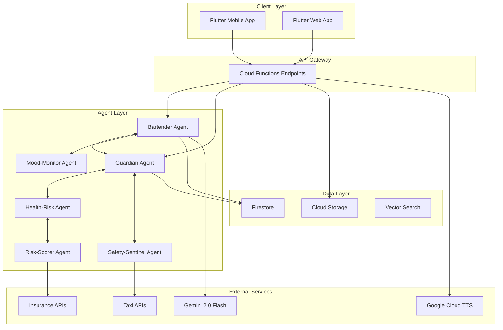

# アーキテクチャ概要

最終更新: 2025-06-30

## システム全体構成

Alco Guardian は、マルチエージェント協調システムを採用した、リアルタイム飲酒管理アプリケーションです。



## コア設計原則

### 1. エージェントファースト設計
- すべての機能を自律的なエージェントとして実装
- 各エージェントは単一責任原則に従う
- エージェント間は A2A プロトコルで通信

### 2. リアルタイム介入
- 飲酒中の行動変容を即座にサポート
- Guardian エージェントによる継続的な監視
- 段階的な警告システム（緑→黄→橙→赤）

### 3. プライバシーファースト
- 個人データの暗号化（AES-256）
- 最小権限の原則
- データの匿名化オプション

## エージェント詳細

### Bartender Agent
**役割**: 会話生成・嗜好提案
- Gemini 2.0 Flash による自然な対話
- コンテキストに応じた返答生成
- 音声応答の生成（TTS）

**主要 A2A メッセージ**:
- `drink.suggest` - 飲み物の提案
- `context.chat` - 会話コンテキストの共有

### Guardian Agent 
**役割**: ペース／量監視・警告
- 純アルコール量の計算と追跡
- 飲酒ペースの分析
- 段階的警告の発行

**主要 A2A メッセージ**:
- `alert.veto` - 飲酒制限の発動
- `alc.stats` - アルコール統計の共有

### Health-Risk Agent
**役割**: 疾患リスク試算
- 長期的な健康リスクの評価
- WHO ガイドラインに基づく分析
- 週次レポートの生成

**主要 A2A メッセージ**:
- `risk.report` - リスクレポートの送信

### Safety-Sentinel Agent
**役割**: 位置 & BAC 監視・緊急対応
- 推定 BAC の計算
- 終電アラート
- 緊急連絡先への通知

**主要 A2A メッセージ**:
- `emergency.flow` - 緊急フローの起動

### Mood-Monitor Agent
**役割**: 孤独・感情スコア推定
- 会話内容からの感情分析
- 孤独感スコアの算出
- メンタルヘルスサポート

**主要 A2A メッセージ**:
- `mood.score` - 感情スコアの共有

### Risk-Scorer Agent
**役割**: 保険 API 連携
- 行動データの収集と分析
- 保険料の動的計算
- 暗号化データの送信

**主要 A2A メッセージ**:
- `premium.update` - 保険料更新の通知

## データフロー

### 1. 音声入力フロー
```
User Voice → Flutter App → /transcribe → Gemini 2.0 Flash
→ Text → /chat → Bartender Agent → Response + TTS → User
```

### 2. 飲酒記録フロー
```
User Action → /add_drink → Guardian Agent → Analysis
→ A2A Message → Other Agents → Coordinated Response
```

### 3. エージェント間通信フロー
```
Agent A → A2A Message → Firestore (Message Queue)
→ Agent B → Process → Response → A2A Message → Agent A
```

## 技術スタック詳細

### フロントエンド
- **Flutter 3.32**: クロスプラットフォーム対応
- **Firebase Auth**: ユーザー認証
- **Provider/Riverpod**: 状態管理
- **http package**: API 通信

### バックエンド
- **Cloud Functions Gen2**: サーバーレス実行環境
- **Python 3.12**: 実装言語
- **Firebase Admin SDK**: データベースアクセス
- **Google Cloud APIs**: AI/ML サービス

### AI/ML
- **Gemini 2.0 Flash**: 会話生成・音声認識
- **Google Cloud TTS**: 音声合成
- **Vertex AI**: 将来的な ML モデルホスティング

### データストア
- **Firestore**: NoSQL データベース
- **Cloud Storage**: 音声ファイル保存
- **Vector Search**: セマンティック検索（将来実装）

## セキュリティアーキテクチャ

### 認証・認可
```
User → Firebase Auth → ID Token → Cloud Functions
→ Token Verification → Authorized Access
```

### データ暗号化
- **転送中**: HTTPS (TLS 1.3)
- **保存時**: AES-256-GCM
- **キー管理**: Cloud KMS

### アクセス制御
- **最小権限の原則**: 各サービスアカウントは必要最小限の権限のみ
- **VPC-SC**: 将来的な実装予定
- **監査ログ**: Cloud Logging による全アクセスの記録

## スケーラビリティ

### 水平スケーリング
- Cloud Functions の自動スケーリング
- Firestore の自動シャーディング
- Cloud Storage の無制限容量

### パフォーマンス最適化
- **Cold Start 対策**: Gen2 + 最小インスタンス設定
- **キャッシング**: TTS 結果の 24 時間キャッシュ
- **CDN**: 静的アセットの配信最適化

### 負荷分散
- Cloud Functions の内部負荷分散
- マルチリージョン対応（将来実装）

## 監視・運用

### モニタリング
- **Cloud Monitoring**: システムメトリクス
- **Cloud Logging**: アプリケーションログ
- **Error Reporting**: エラーの自動検出と通知

### アラート
- エラー率 > 5% で通知
- レスポンスタイム > 3秒で警告
- 日次使用量レポート

### バックアップ
- Firestore の日次自動バックアップ
- 7 日間の保持期間
- ポイントインタイムリカバリ対応

## 今後の拡張計画

### フェーズ 1（現在）
- ✅ 基本的なエージェント実装
- ✅ 音声対話機能
- ✅ Guardian による監視

### フェーズ 2（3ヶ月以内）
- IoT デバイス連携（スマートコースター）
- 機械学習モデルの導入
- マルチ言語対応

### フェーズ 3（6ヶ月以内）
- B2B API の公開
- 保険会社との本格連携
- グローバル展開

## 開発ガイドライン

### コーディング規約
- Python: PEP 8
- Flutter: Effective Dart
- コミット: Conventional Commits

### テスト戦略
- 単体テスト: 80% カバレッジ目標
- 統合テスト: 主要フロー全て
- E2E テスト: クリティカルパス

### デプロイメント
- GitHub Actions による CI/CD
- ステージング環境での検証
- カナリアリリース戦略