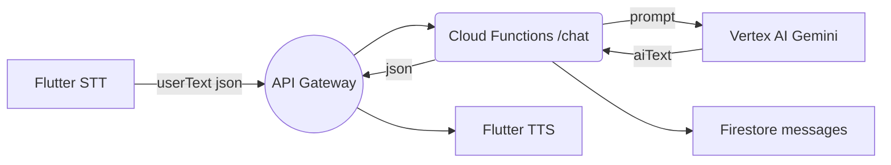

# 音声対話 MVP 用 API 設計書  
_GCP Cloud Functions + Vertex AI Gemini_

---

## 0. 前提
- **Base URL**（例）  
  `https://asia-northeast1-<PROJECT_ID>.cloudfunctions.net`
- **Auth**: Firebase **ID トークン**  
  `Authorization: Bearer <idToken>`
- **Content‑Type**: `application/json; charset=utf‑8`
- 全エンドポイントは **HTTPS 必須**

---

## 1. エンドポイント一覧

| # | メソッド | パス | 用途 |
|---|---------|-----|------|
| 1 | `POST` | `/v1/chat` | ユーザ発話を Gemini に送り、AI 応答を返す **メイン API** |
| 2 | `POST` | `/v1/sessions` | 飲酒セッション開始（MVP ではダミー） |
| 3 | `GET`  | `/v1/sessions/{sessionId}/messages?limit=N` | 過去メッセージ取得（UI スクロール用、省略可） |

> **MVP フェーズ**では `POST /v1/chat` だけ実装しても可。  
> ②③は将来の飲酒機能連携を見据え雛形だけ用意。

---

## 2. 基本スキーマ

### 2‑1. `POST /v1/chat`  

| 項目 | 内容 |
|------|------|
| 説明 | ユーザ音声を文字起こししたテキスト (`userText`) を受け取り、Vertex AI Gemini で生成した応答 (`aiText`) を返す |
| 認証 | Firebase ID トークン必須 |
| Rate Limit | **60 リクエスト / 分 / uid** （HTTP 429 超過） |

#### Request Body

```json5
{
  "uid": "abc123",          // Firebase UID (省略可：トークンから抽出)
  "sessionId": "2025-05-12T09:00", // 現飲酒セッションID (任意)
  "userText": "今日もお疲れさま！ビール飲んでいい？",
  "lang": "ja"              // "ja" | "en" … 将来の多言語用
}
```

#### Response Body `200 OK`

```json5
{
  "messageId": "msg_9f83b2",
  "aiText": "お疲れさま♪ その前に明日の朝早くない？",
  "usage": {
    "promptTokens": 58,
    "completionTokens": 31,
    "totalTokens": 89
  },
  "createdAt": "2025-05-11T13:25:48Z"
}
```

#### エラーレスポンス

| HTTP | code | message | 代表原因 |
|------|------|---------|---------|
| 400 | `INVALID_REQUEST` | 必須フィールド欠落 | userText が空 |
| 401 | `UNAUTHORIZED` | トークン不正 | JWT 期限切れ |
| 429 | `RATE_LIMIT` | Too many requests | 60 req/min 超 |
| 500 | `INTERNAL` | Unexpected error | Gemini API 障害 |

---

### 2‑2. `POST /v1/sessions`（雛形）

```json5
POST /v1/sessions
{
  "uid": "abc123",
  "startedAt": "2025-05-11T12:00:00Z"
}
→ 201 Created
{
  "sessionId": "sess_9a17c2"
}
```

---

### 2‑3. `GET /v1/sessions/{sessionId}/messages`

```
GET /v1/sessions/sess_9a17c2/messages?limit=30
→ 200 OK
[
  { "role":"user", "text":"…", "timestamp":"…"},
  { "role":"ai",   "text":"…", "timestamp":"…"}
]
```

---

## 3. フロー図（/chat のみ簡易）



---

## 4. 実装ガイド

### 4‑1. Cloud Functions (Node.js 20)

```js
export const chat = onRequest(async (req, res) => {
  try {
    const {uid, userText, sessionId = "default"} = req.body;
    // 1. レート制限 & バリデーション
    // 2. Gemini API 呼び出し
    const aiText = await callGemini(userText);
    // 3. Firestore 保存
    await saveChat(uid, sessionId, userText, aiText);
    res.status(200).json({messageId: nanoid(), aiText, usage});
  } catch (e) {
    handleError(res, e);
  }
});
```

### 4‑2. Flutter HTTP ラッパ

```dart
final resp = await dio.post(
  '/v1/chat',
  data: {'userText': sttText},
  options: Options(
    headers: {'Authorization': 'Bearer $idToken'},
    contentType: 'application/json',
  ),
);
final aiText = resp.data['aiText'];
```

---

## 5. 今後の拡張ポイント

| 項目 | 次フェーズ対応案 |
|------|----------------|
| Function Calling | `"function":"calculateAlcohol"` をプロンプトに注入 |
| WebSocket 化 | 長尺会話でチャンク配信 (`aiText` ストリーム) |
| ミドルウェア | Cloud Endpoints → API Key + Quota 管理 |
| OpenAPI Spec | `openapi.yaml` 自動生成 → SwaggerUI でドキュメント化 |

---

> **この設計書をベースに実装を進め、動作確認後に飲酒管理ロジックやアバター同期を追加していきましょう。**
