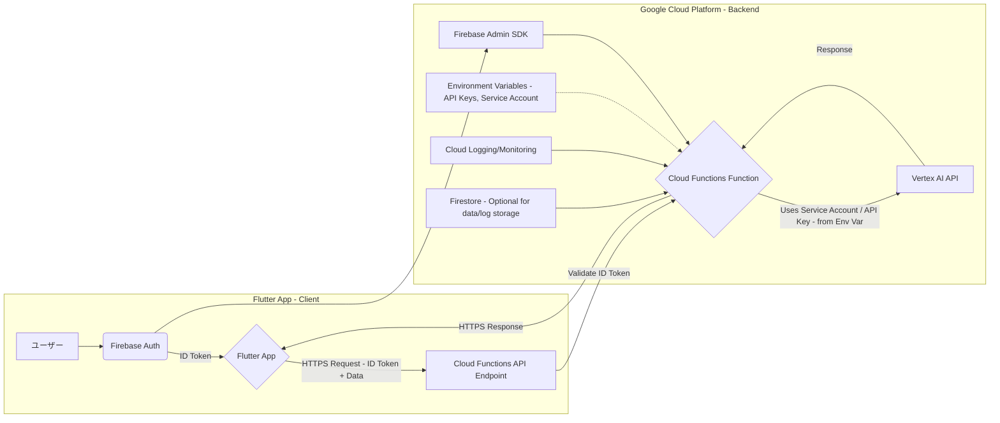

# FlutterアプリからのVertex AI API利用におけるAPIキー管理とアーキテクチャのベストプラクティス

## 1. はじめに

本文書は、FlutterアプリケーションからGoogle Cloud Vertex AI APIを利用する際の、APIキー管理およびシステムアーキテクチャに関するベストプラクティスをまとめたものです。特に、ソースコードの提出が求められるハッカソンなどの状況において、セキュリティと運用効率を両立するための指針を提供します。

プロジェクト `alco-guardian` の `docs/api.md` で示されている既存の設計思想（Firebase IDトークンを利用した認証）とも整合性を取る形で、より安全かつ堅牢な構成を提案します。

## 2. チャットで提起された主な疑問点と課題

開発初期段階のチャットにおいて、主に以下の疑問点や課題が議論されました。

*   **音声処理フロー**: 音声ファイルをストレージにアップロード後、Vertex AIで文字起こしを行う流れの検討。
*   **API直接呼び出し**: FlutterアプリからVertex AI APIを直接呼び出す構成の可能性と、その場合のAPIキー管理。
*   **クライアントサイドのAPIキー管理**: Flutterアプリ内にAPIキーをどのように安全に保持するか (e.g., `.env` ファイル、難読化)。
*   **セキュリティ懸念**: クライアントサイドにAPIキーを保持する場合の、ソースコード解析によるキー漏洩リスク。
*   **バックエンド利用の検討**: APIキーをサーバーサイド（バックエンド）で管理する構成の優位性。
*   **GCPサービスアカウント**: Vertex AIなどGCPサービスを利用する際のサービスアカウントの役割とキー管理。
*   **ソースコード提出**: GitHubなどでソースコードを提出する場合の、APIキーの取り扱い。

これらの疑問は、特にAPIキーという機密情報をどのように保護しつつ、アプリケーションの機能を実現するかという点に集約されます。

## 3. 推奨アーキテクチャ: バックエンドAPI (Cloud Functions) 経由

セキュリティ、管理性、拡張性の観点から、以下のアーキテクチャを強く推奨します。

### 3.1. 構成要素とデータフロー

1.  **Flutterアプリ (クライアントサイド)**
    *   **ユーザー認証**: Firebase Authenticationを利用してユーザーを認証し、Firebase IDトークンを取得します。
    *   **リクエスト送信**: Vertex AIを利用するリクエスト（例: 文字起こし対象のデータ）を、取得したFirebase IDトークンと共にHTTPSでCloud FunctionsのAPIエンドポイントに送信します。
    *   **機密情報非保持**: Vertex AIのAPIキーやサービスアカウントキーなどの機密情報は一切アプリ内に保持しません。

2.  **Cloud Functions (サーバーサイド/バックエンド)**
    *   **APIエンドポイント**: Flutterアプリからのリクエストを受け付けるHTTPトリガー関数を作成します。
    *   **IDトークン検証**: 受け取ったリクエストの`Authorization`ヘッダーからFirebase IDトークンを抽出し、Firebase Admin SDKを使ってトークンを検証します。これにより、認証されたユーザーからの正当なリクエストであることを確認します。
    *   **認証情報管理**: **Vertex AIのAPIキーや、Cloud FunctionsがVertex AIにアクセスするためのサービスアカウントキーは、Cloud Functionsの環境変数として安全に設定・管理します。**
    *   **Vertex AI API呼び出し**: 環境変数から認証情報を読み込み、Vertex AIのクライアントライブラリを初期化して、クライアントから受け取ったデータに基づきVertex AI APIを呼び出します。
    *   **レスポンス処理**: Vertex AIからの結果を整形し、Flutterアプリに応答として返します。

### 3.2. 推奨構成のメリット

*   **セキュリティ向上**:
    *   **APIキーの秘匿化**: Vertex AIのAPIキーやサービスアカウントキーがクライアントアプリのコードやリポジトリに含まれないため、不正利用のリスクを根本から低減できます。
    *   **認証・認可の強化**: Firebase IDトークンによるユーザー認証と、サーバーサイドでのリクエスト検証により、強固なセキュリティを実現します。
*   **管理性・運用性**:
    *   **一元管理**: APIキーのローテーション、アクセス権限の変更、利用状況の監視などをサーバーサイドで集中的に管理できます。
    *   **ロジック集約**: API連携やビジネスロジックをバックエンドに集約することで、クライアントはUI/UXに注力でき、コードの見通しも良くなります。
*   **柔軟性と拡張性**:
    *   **機能追加の容易さ**: レートリミット、キャッシング、他のGCPサービス（例: Firestore, Cloud Storage）との連携など、将来的な機能拡張がサーバーサイドで容易に行えます。
    *   **クライアント非依存**: バックエンドAPIのインターフェースが安定していれば、将来的に他のクライアント（Webアプリなど）からの利用も容易になります。

## 4. APIキーおよびサービスアカウントキーの具体的な管理方法

*   **Cloud Functionsの環境変数**:
    *   Vertex AI APIキー（もし利用する場合）や、Cloud FunctionsがVertex AIにアクセスするためのサービスアカウントのJSONキーファイルの内容は、Cloud Functionsのデプロイ時に環境変数として設定します。
    *   ソースコードにはキーそのものを記述せず、関数内で環境変数を参照して利用します。
    *   例 (Node.js): `process.env.VERTEX_AI_API_KEY` や `process.env.GOOGLE_APPLICATION_CREDENTIALS_JSON`
*   **サービスアカウントの権限**:
    *   Cloud FunctionsがVertex AIを利用するために必要な最小限のIAMロール（例: `Vertex AI ユーザー`ロール）を、Cloud Functionsの実行サービスアカウント、または専用に作成したサービスアカウントに付与します。
*   **ローカル開発環境**:
    *   ローカルでの開発時には、環境変数ファイル (`.env` など、`.gitignore` に追加すること) を使用して機密情報を管理し、Firebase Local Emulator Suite や Cloud Functions Emulator を利用してテストを行います。

## 5. ハッカソンにおける考慮点

*   **実装コストと時間のバランス**: バックエンドを構築する手間はありますが、FirebaseやCloud Functionsは比較的迅速にセットアップ可能です。セキュリティ面での大きなメリットを考慮すると、投資する価値は十分にあります。
*   **審査評価**: セキュリティ対策や堅牢なアーキテクチャ設計は、技術的な評価ポイントとなり得ます。
*   **「動けばOK」の先へ**: 単に機能が動作するだけでなく、安全でスケーラブルな設計を示すことは、プロジェクトの完成度を高めます。

## 6. 代替案とそのリスク (非推奨)

チャットでも議論された、クライアントサイド（Flutterアプリ内）でAPIキーを管理する方法（例: `.env`ファイルに記述し、ビルド時に埋め込む + コード難読化）も技術的には可能です。

しかし、このアプローチには以下の重大なリスクが伴います。

*   **キー漏洩のリスク**: アプリのバイナリをリバースエンジニアリングすることで、難読化されていてもAPIキーが抽出される可能性があります。一度漏洩すると、不正利用による高額請求やサービス停止のリスクがあります。
*   **キーローテーションの困難さ**: キーが漏洩した場合、アプリのアップデートを全ユーザーに強制する必要があり、対応が遅れると被害が拡大します。

**ソースコードを提出するハッカソンにおいては、クライアントサイドでのAPIキー管理は極力避けるべきです。**

## 7. 結論

FlutterアプリケーションからVertex AI APIを利用する際は、セキュリティ、管理性、拡張性を考慮し、**Cloud Functions等のサーバーレスバックエンドを介してAPIを呼び出し、APIキーやサービスアカウントキーはバックエンドの環境変数で管理するアーキテクチャを強く推奨します。**

このアプローチにより、機密情報を安全に保ちつつ、堅牢でスケーラブルなアプリケーションを構築することができます。
 