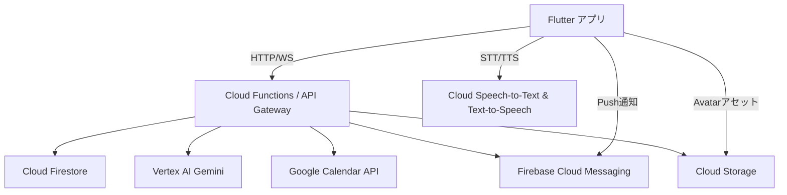

# 飲酒 × AI エージェント アプリ設計書

_GCP・Flutter・Firebase 想定_

---

## 1. 目的 / ビジョン

-   **孤独なひとり飲みを、AI アバターとの対話で楽しく安全に**
-   **飲酒量・ペースを可視化し、翌日の予定や健康リスクに応じてリアルタイム注意喚起**
-   **過去会話 & 飲酒履歴を学習し “あなた専属の飲み友” が成長する体験**

---

## 2. 想定ユーザー・ユースケース

| ペルソナ         | ニーズ                           | 代表シナリオ                                                                    |
| ---------------- | -------------------------------- | ------------------------------------------------------------------------------- |
| 20〜40  代会社員 | ひとり飲みの寂しさ／飲み過ぎ防止 | 仕事後の宅飲み。アバターと乾杯 →2 杯目が早いと注意 → 翌朝会議に合わせ就寝を促す |
| 在宅ワーカー     | リズム崩れやすい生活での飲酒管理 | 夕食前後の飲酒をカレンダー予定と突き合わせ、睡眠ログ連動で改善提案              |
| お酒ビギナー     | 自分の適量がわからない           | 純アルコール量を計算しながら飲み方を学習。「今日は軽めに」を提案                |

---

## 3. 主要機能

| カテゴリ                 | 機能                                          | 説明                                      |
| ------------------------ | --------------------------------------------- | ----------------------------------------- |
| **対話 AI**              | テキスト / 音声対話、3D/2D アバター同期       | Vertex AI Gemini 1.5 Pro ＋ Cloud TTS/STT |
|                          | 多言語対応（拡張）                            |                                           |
| **飲酒トラッキング**     | ドリンク登録                                  | 銘柄・度数・量から純アルコール量を算出    |
|                          | 写真 OCR 自動認識（拡張）                     |                                           |
| **ペース／量監視**       | 飲み過ぎ・速飲み警告                          | WHO 指針 + カスタム閾値                   |
| **カレンダー連携**       | Google Calendar 同期                          | 翌日の重要予定を踏まえた助言              |
| **ログ & レポート**      | 会話＋飲酒履歴タイムライン、週次 PDF レポート | Push / メール送信                         |
| **学習・パーソナライズ** | 履歴 Embedding で個別トーン維持               | Vertex AI Matching Engine                 |
| **セーフティ**           | 緊急連絡提案、アルハラ対策 Tips               | GPS ＋時間帯でタクシーアプリ提案など      |

---

## 4. システム構成（Mermaid）

---

## 5. 技術選定

| レイヤ       | 採用技術                                      | 理由                                |
| ------------ | --------------------------------------------- | ----------------------------------- |
| クライアント | **Flutter 3.x**                               | iOS/Android/Web 共通・3D 拡張容易   |
| 認証         | Firebase Authentication                       | OAuth 統合・匿名 → 本登録           |
| データ       | Cloud Firestore                               | リアルタイム & オフラインキャッシュ |
| 会話 AI      | Vertex AI Gemini 1.5 Pro                      | 長大履歴 & Function Calling         |
| 音声         | Cloud Speech‑to‑Text / Text‑to‑Speech         | 日本語品質 ◎                        |
| バックエンド | Cloud Functions 2nd gen (Node.js)             | スケール自動、Firebase 親和性       |
| ジョブ       | Cloud Scheduler + Pub/Sub                     | 週次レポートなど                    |
| メディア     | Cloud Storage                                 | CDN & Signed URL                    |
| 監視         | Cloud Logging / Error Reporting / BigQuery    | コスト・トラフィック分析            |
| CI/CD        | GitHub Actions → Cloud Build                  | 自動テスト & デプロイ               |
| テスト       | Flutter Integration Test / Functions Emulator | LLM ゴールデンプロンプト            |

---

## 6. データモデル（Firestore）

| コレクション                    | ドキュメント ID | フィールド例                                |
| ------------------------------- | --------------- | ------------------------------------------- |
| `users`                         | `uid`           | name, targetBAC, calendarToken              |
| `sessions`                      | `sessionId`     | uid, startTime, endTime, totalAlcoholGram   |
| `sessions/{sessionId}/drinks`   | auto            | type, volumeMl, abv, alcoholGram, createdAt |
| `sessions/{sessionId}/messages` | auto            | role, text, ttsUrl, timestamp               |
| `calendarEvents`                | `eventId`       | uid, start, end, summary, importance        |
| `weeklyReports`                 | `YYYY-WW`       | uid, pdfUrl, metricsJson                    |

---

## 7. 主フロー

1. **セッション開始**

    - ユーザ: 「今から飲むよ」→ `sessions` 作成
    - AI: カレンダー確認 → 翌朝予定を踏まえアドバイス

2. **ドリンク登録**

    - 音声入力「プレモル 350 ml」→ STT → NLP → `drinks` 登録
    - 純アルコール量計算 → 閾値超過なら注意

3. **対話ループ**

    - 会話履歴 + 飲酒量 → Gemini プロンプト
    - 出力 → TTS → アバター口パク

4. **セッション終了**

    - 手動停止 or 無操作タイムアウト
    - 翌朝 Cloud Scheduler が振り返りプッシュ

5. **週次レポート**
    - 日曜夜 Cloud Functions → PDF 生成 → メール送付

---

## 8. 非機能要件

| 項目             | 目標                                    |
| ---------------- | --------------------------------------- |
| レイテンシ       | 応答 < 2.5  秒、警告 < 1  秒            |
| コスト           | 1 MAU あたり \$1 以内                   |
| スケーラビリティ | 同時接続 10 000                         |
| セキュリティ     | OAuth2, Firestore Rules, 暗号化         |
| 遵法性           | 20 歳未満登録不可、医療行為でない旨明記 |

---

## 9. 開発ロードマップ（6  か月）

| Sprint | 主な成果物                           |
| ------ | ------------------------------------ |
| 1–2    | Flutter プロトタイプ（UI・アバター） |
| 3–4    | Firestore モデル・飲酒計算           |
| 5–6    | Gemini 連携・警告ロジック            |
| 7–8    | Calendar OAuth・Push 通知            |
| 9–10   | 音声対話 MVP                         |
| 11–12  | 週次レポート・β 公開                 |
| 13+    | ML パーソナライズ・ストア配信        |

---

## 10. リスク & 対策

| リスク                 | 対策                           |
| ---------------------- | ------------------------------ |
| LLM 誤情報 / 飲酒助長  | プロンプト制御 & NG ワード検閲 |
| STT 精度低下（酔音声） | 確認リピート・マイク学習       |
| GCP コスト高騰         | Token 監視 → モデル縮小        |
| 規制変更               | 法律ウォッチャー週次通知       |

---

## 11. 今後の拡張アイデア

-   **スマートコースター連携**
-   **ウェアラブル心拍・睡眠データ取込み**
-   **フレンド招待でマルチ対話乾杯**
-   **企業向け SDK（安全な飲みニケーション）**

---
