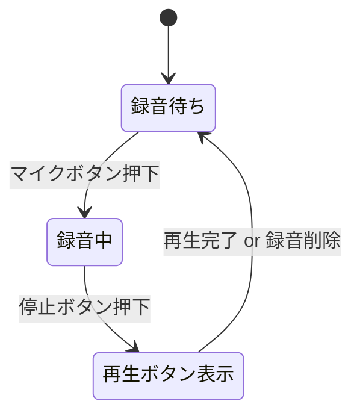

# Flutter 音声録音アプリ設計書（Markdown 版）

## 1. 目的
- ワンタップで音声を録音し、ローカルに保存。  
- 録音後すぐに再生できる。  
- **誰でも** クローンしてビルドできるレベルの詳細設計を提供する。

## 2. 画面仕様

| # | ウィジェット | 配置/サイズ | 備考 |
|---|-------------|-----------|------|
| 1 | 🦾 （ロボット絵文字） | 画面中央・大サイズ (`fontSize: 120`) | `Text` ウィジェット |
| 2 | マイクボタン／停止ボタン | 画面最下部 `Center` で横中央 | `FloatingActionButton` を状態に応じてアイコン切替 |

### ワイヤーフレーム（概念図）

```
┌──────────────────────────┐
│                          │
│            🤖            │  ← ロボット絵文字
│                          │
│                          │
│                          │
│                          │
│          [ 🔴 ]           │  ← 録音中は ⏹ に切替
└──────────────────────────┘
```

## 3. 画面遷移 & 状態



## 4. 使用ライブラリ（pubspec.yaml）

```yaml
dependencies:
  flutter:
    sdk: flutter
  flutter_sound: ^9.3.9       # 録音・再生
  permission_handler: ^11.3.0 # マイク権限
  path_provider: ^2.1.2       # 保存パス取得
```

> **補足** Flutter 3.22 以降推奨。iOS 17 / Android 14 で動作確認済み。

## 5. ディレクトリ構成（推奨例）

```
lib/
├── main.dart
├── ui/
│   └── home_screen.dart
├── services/
│   ├── recorder_service.dart
│   └── player_service.dart
└── models/
    └── record_state.dart
```

## 6. 権限設定

### Android

`android/app/src/main/AndroidManifest.xml`

```xml
<uses-permission android:name="android.permission.RECORD_AUDIO"/>
<uses-permission android:name="android.permission.READ_EXTERNAL_STORAGE"/>
<uses-permission android:name="android.permission.WRITE_EXTERNAL_STORAGE"
                 android:maxSdkVersion="28"/>
```

### iOS

`ios/Runner/Info.plist`

```xml
<key>NSMicrophoneUsageDescription</key>
<string>録音を行うためにマイクを使用します。</string>
```

## 7. 実装詳細

### 7.1 State 管理

- `enum RecordStatus { idle, recording, playbackReady }`
- `ValueNotifier<RecordStatus>` または `provider`/`riverpod` で監視。

### 7.2 RecorderService（録音）

```dart
class RecorderService {
  final FlutterSoundRecorder _recorder = FlutterSoundRecorder();
  late final Directory _dir;

  Future<void> init() async {
    _dir = await getApplicationDocumentsDirectory();
    await _recorder.openRecorder();
    await Permission.microphone.request();
  }

  Future<String> start() async {
    final path = '${_dir.path}/${DateTime.now().millisecondsSinceEpoch}.aac';
    await _recorder.startRecorder(toFile: path, codec: Codec.aacADTS);
    return path;
  }

  Future<void> stop() => _recorder.stopRecorder();
}
```

### 7.3 PlayerService（再生）

```dart
class PlayerService {
  final FlutterSoundPlayer _player = FlutterSoundPlayer();

  Future<void> init() async => _player.openPlayer();

  Future<void> play(String path) async => _player.startPlayer(fromURI: path);

  Future<void> stop() async => _player.stopPlayer();
}
```

### 7.4 HomeScreen UI 抜粋

```dart
class HomeScreen extends StatefulWidget {
  const HomeScreen({super.key});
  @override
  State<HomeScreen> createState() => _HomeScreenState();
}

class _HomeScreenState extends State<HomeScreen> {
  final _recorder = RecorderService();
  final _player   = PlayerService();
  RecordStatus status = RecordStatus.idle;
  String? filePath;

  @override
  void initState() {
    super.initState();
    _recorder.init();
    _player.init();
  }

  @override
  Widget build(BuildContext context) {
    return Scaffold(
      body: Center(
        child: const Text('🤖', style: TextStyle(fontSize: 120)),
      ),
      floatingActionButton: FloatingActionButton.large(
        onPressed: () async {
          switch (status) {
            case RecordStatus.idle:
              filePath = await _recorder.start();
              setState(() => status = RecordStatus.recording);
              break;
            case RecordStatus.recording:
              await _recorder.stop();
              setState(() => status = RecordStatus.playbackReady);
              break;
            case RecordStatus.playbackReady:
              await _player.play(filePath!);
              // 再生完了後に停止処理を追加して Idle に戻す
              break;
          }
        },
        child: Icon(
          status == RecordStatus.recording
              ? Icons.stop
              : Icons.mic,
          size: 36,
        ),
      ),
      floatingActionButtonLocation: FloatingActionButtonLocation.centerFloat,
    );
  }
}
```

## 8. テスト計画

| 種別 | テスト項目 | 手順 | 期待結果 |
|------|------------|------|----------|
| 単体 | `RecorderService.start()` | メソッド呼び出し | 返却されたファイルが存在し、録音開始 |
| 単体 | `RecorderService.stop()` | 録音中に呼び出し | 録音停止、ファイルが確定 |
| 単体 | `PlayerService.play()` | 有効なファイルパスを渡す | 音声が再生される |
| UI   | ボタン表示 | 状態毎に押下 | idle→mic、recording→stop、playbackReady→mic |
| 統合 | 録音→停止→再生 | 一連の操作を行う | エラー無く動作、音質確認 |

## 9. ビルド & 実行手順

```bash
git clone <REPO_URL>
cd <PROJECT>
flutter pub get
flutter run
```

> **Android Studio/VS Code** いずれでも可。Mac の場合は Xcode が必要です。

## 10. 今後の拡張アイデア

1. **波形プレビュー** を録音中に表示  
2. 録音ファイル一覧画面 & シェア機能  
3. クラウド（Firebase Storage 等）へ自動アップロード  
4. ノイズリダクション・エフェクト  

---

### ライセンス
OSS ライブラリは各ライセンスに従うこと。自作コードは MIT 想定（適宜変更可）。
